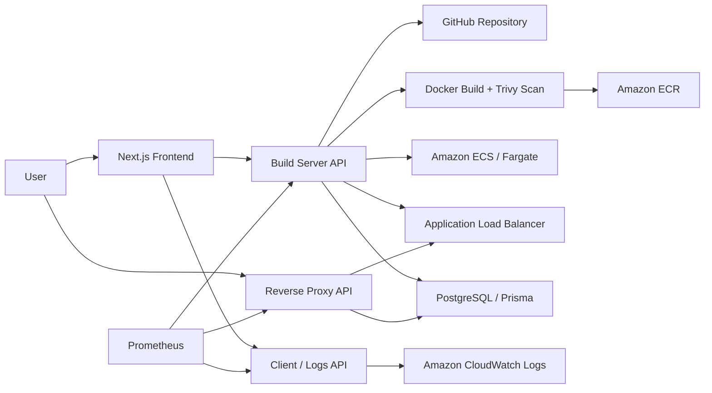

# DNS

DNS is a self-hosted website and API hosting platform inspired by Vercel, intended to be hosted publicly as `DNS.com`. The project accepts a GitHub repository, builds it into a Docker image, pushes the image to Amazon ECR, provisions an ECS/Fargate service behind an Application Load Balancer, and stores a subdomain-to-deployment mapping for reverse proxy routing.

This repository is a capstone/prototype platform engineering project focused on backend infrastructure, AWS SDK automation, container orchestration, CI/CD, observability, and deployment lifecycle management.

## Why This Project Exists

Most open-source Vercel-style clones focus on static hosting, local Docker, or simplified deployment flows. DNS explores a deeper backend implementation using AWS primitives directly:

- AWS SDK based provisioning instead of manual console steps
- Docker image build, scan, tag, and push workflow
- ECS/Fargate task and service creation
- Application Load Balancer and target group provisioning
- Subdomain based reverse proxying
- CloudWatch log retrieval
- Prometheus metrics endpoints
- Jenkins based CI/CD pipeline experiments

## Architecture



## Services

### `frontend`

Next.js application used to submit deployment requests and view deployment pages.

Key responsibilities:

- Collect GitHub repository URL, deployment type, deployment name, and exposed port
- Call the build server API
- Provide deployment and deployment-detail screens

Default local URL:

```bash
http://localhost:3000
```

### `build-server-api`

Main backend service responsible for the deployment lifecycle.

Key responsibilities:

- Create users, deployments, and proxy records with Prisma
- Clone a GitHub repository into a temporary build directory
- Generate a Dockerfile for frontend, backend, or Python apps if one is missing
- Build a Docker image
- Run a Trivy image scan
- Authenticate with Amazon ECR
- Push the image to ECR
- Register an ECS task definition
- Create an Application Load Balancer, listener, and target group
- Create an ECS/Fargate service
- Expose Prometheus metrics at `/metrics`

Important routes:

```text
GET  /health
GET  /metrics
GET  /data
POST /users
POST /deployments
POST /proxies
POST /deploy-repo
```

### `reverse-proxy-api`

Subdomain routing service that looks up a deployment target in the database and proxies traffic to the matching AWS load balancer.

Key responsibilities:

- Parse the incoming hostname
- Extract the requested subdomain
- Look up the subdomain in the `Proxy` table
- Health-check the target server
- Forward traffic using `http-proxy`
- Expose Prometheus metrics at `/metrics`

Default local URL:

```bash
http://localhost:8000
```

### `client-api`

Logs service for reading deployment logs from CloudWatch.

Key responsibilities:

- Resolve an ECS log group from a deployment name
- Fetch the latest CloudWatch log stream
- Return formatted log events
- Expose Prometheus metrics at `/metrics`

Important routes:

```text
GET /health
GET /metrics
GET /logs/:repoName
```

### `log-viewer`

Vite React application intended for a dedicated log viewing experience. This is currently scaffolded and can be extended to consume `client-api`.

## Tech Stack

- Frontend: Next.js, React, TypeScript, Tailwind CSS, Radix UI, Zustand
- Backend: Node.js, Express.js, Prisma
- Cloud: AWS ECR, ECS/Fargate, Elastic Load Balancing, CloudWatch Logs, VPC, IAM
- Database: PostgreSQL
- DevOps: Docker, Jenkins, Trivy, SonarQube
- Observability: Prometheus, CloudWatch

## Repository Structure

```text
.
├── build-server-api      # Deployment orchestration API
├── client-api            # CloudWatch logs API
├── frontend              # Next.js web app
├── log-viewer            # Vite log viewer scaffold
├── prometheus            # Prometheus config and metrics helpers
├── reverse-proxy-api     # Subdomain reverse proxy service
├── Jenkinsfile           # CI/CD pipeline
└── sonar-project.properties
```

## Environment Variables

Create service-specific `.env` files from the provided `.env.example` files.

### `build-server-api/.env.example`

```env
AWS_ACCESS_KEY_ID=
AWS_SECRET_ACCESS_KEY=
AWS_REGION=
PORT=8011
ECS_CLUSTER_NAME=
SUBNET_IDS=
SECURITY_GROUP_ID=
ALLOWED_IPS=
TASK_ROLE_ARN=
VPC_ID=
DATABASE_URL=
```

### `client-api/.env.example`

```env
AWS_ACCESS_KEY_ID=
AWS_SECRET_ACCESS_KEY=
AWS_REGION=ap-south-1
PORT=8012
```

### `reverse-proxy-api/.env.example`

```env
DATABASE_URL=
PORT=8000
```

### `frontend/.env.example`

```env
NEXT_PUBLIC_BUILD_SERVER_URL=http://localhost:8011
NEXT_PUBLIC_CLIENT_SERVER_URL=http://localhost:8012
```

Adjust these URLs to match the ports used by your backend services.

## Local Development

Install dependencies for each service:

```bash
cd frontend && npm install
cd ../build-server-api && npm install
cd ../client-api && npm install
cd ../reverse-proxy-api && npm install
cd ../log-viewer && npm install
```

Generate Prisma clients after configuring `DATABASE_URL`:

```bash
cd build-server-api
npx prisma generate

cd ../reverse-proxy-api
npx prisma generate

cd ../client-api
npx prisma generate
```

Start the services:

```bash
cd build-server-api
npm run dev
```

```bash
cd client-api
npm run dev
```

```bash
cd reverse-proxy-api
npm run dev
```

```bash
cd frontend
npm run dev
```

## Deployment Request Example

```bash
curl -X POST http://localhost:8011/deploy-repo \
  -H "Content-Type: application/json" \
  -d '{
    "repoUrl": "https://github.com/username/repo",
    "DeploymentName": "demo-app",
    "buildType": "FRONTEND",
    "port": 3000
  }'
```

Supported deployment types:

```text
FRONTEND
BACKEND
PYTHON
```

## CI/CD

The Jenkins pipeline includes Docker build and push stages for service-specific branches, with ECS redeployment support. The repository also contains SonarQube configuration for static analysis experiments.

## Observability

Each backend service exposes a Prometheus-compatible `/metrics` endpoint through `prom-client`.

CloudWatch logs are retrieved through `client-api`:

```text
GET /logs/:repoName
```

The build server configures ECS log groups using this pattern:

```text
/ecs/:DeploymentName-logs
```

## Current Status

Implemented:

- Multi-service backend architecture
- AWS SDK based ECR, ECS, and ELB provisioning
- Docker build and push workflow
- Prisma models for users, deployments, and proxy mappings
- Reverse proxy lookup by subdomain
- CloudWatch log fetching
- Prometheus metrics endpoints
- Next.js deployment form
- Jenkins CI/CD pipeline experiments

In progress / planned:

- Full frontend integration with live deployment data
- Centralized shared Prisma schema or package
- Better deployment status updates during each build stage
- Safer command execution around repository cloning and Docker commands
- Cleanup workflows for ECS services, load balancers, target groups, and ECR repositories
- Authentication and user management
- Automated integration tests

## Security Notes

This project provisions real AWS infrastructure. Before running it outside a sandbox account:

- Use least-privilege IAM roles
- Avoid logging credentials or secrets
- Validate and sanitize repository URLs and deployment names
- Run builds in isolated workers
- Add quotas and cleanup jobs for AWS resources
- Avoid using long-lived access keys in production

